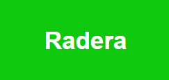
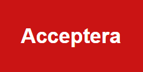
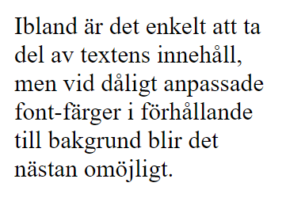
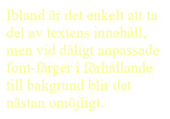

# Användarvänligt gränssnitt

## Vad är ett gränssnitt?
För att kunna designa ett användarvänligt gränssnitt på en hemsida måste vi först bekanta oss med vad ett gränssnitt är och vad det huvudsakliga syftet för ett gränssnitt anses vara [1].

Ett gränssnitt i detta sammanhang är den funktion som möjliggör kommunikation mellan en person och en dator. Gränssnitt i denna redovisning avser den bild som datorn redovisar på datorskärmen och hur en person kan se och förstå resultat som redovisas av datorn samt kunna interagera med mus (pekdon) och tangentbord för att påverka kommandon och indata till datorn [1].

När en webbapplikation startas, visas en hemsida som kan innehålla hänvisningar till ett flertal ytterligare sidor. Det är vanligt att den första sidan (och ofta även övriga sidor) innehåller ett menysystem som används för att välja att gå till länkade sidor. Alternativt kan sidan innehålla klickbara knappar eller klickbara länkar som leder till ytterligare sidor [1].

## Inlärda beteenden och trovärdighet
Människor har vissa inlärda beteenden och underliggande förståenden som tas för givet. För att en hemsida ska vara användarvänlig är det viktigt att ta hänsyn till sådana detaljer. Det skulle till exempel kunna innebära valet av färg vi använder på olika funktionaliteter. Grönt är en färg som de flesta associerar med något positivt eller tillåtande medan rött relateras till en form av varning eller något värt att observera/avstå ifrån. Således är det därför värt att undvika en röd färg på en knapp som används för att acceptera något eller gå vidare på något sätt. Samtidigt är grön inte en lämplig färg att använda då vi vill att användaren ska stanna upp och se över situationen. En motsvarighet skulle vara om man frågade någon en frågade och de skakade på huvudet samtidigt som de sa “Ja”. Det skulle innebära förvirring och hemsidans trovärdighet hade ansetts som låg [1].

 

## Anpassa beroende på målgrupp
Det är även viktigt att ta hänsyn till hemsidans målgrupp innan man utvecklar gränssnittet. Beroende på hemsidans aktuella ämne kan både färg och struktur vara viktigt att efterlikna i förhållande till vad hemsidan försöker representera. Om sidan du besöker är en advokatbyrås hemsida förväntar du dig troligtvis en sida med ordning och reda, sparsamt och sofistikerat urval av färger samt ett uppstrukturerat utseende på diverse sidor som tydligt redovisar deras tjänster. Om du istället skulle mötas av en advokatbyrås hemsida vars upplägg var väldigt färgglatt det vill säga många olika färger och där stylingen var åt det humoristiska hållet skulle du antagligen tro att du kommit till fel sida och inte heller anlita dem då det kan anses som oseriöst. Det är alltså viktigt att göra ett noga urval beroende på målgrupp och sidans område för att skapa trovärdighet bland användarna [1], [3].

## Typsnitt och användningsområde
Vid valet av typsnitt samt storleken på text är det även här viktigt att veta vem som kommer använda sidan. Beroende på vilket intryck man vill att hemsidan ska ge så är det ofta effektivt att blanda flera fonter. Genom att använda ett antal fonter och storlekar på typsnittet kan man hjälpa användaren att navigera och hitta på sidan. I praktiken skulle det kunna innebära större och fetare typsnitt på rubriker för att enklare ta till sig dessa. Det är även viktigt att ta hänsyn till större textstycken och deras textstorlek då det ska vara enkelt att läsa sidan i sitt naturliga format utan att behöva zooma in [4].

Har sidans innehåll koppling till design eller styling av något slag kan element av kursivt typsnitt hjälpa till att bidra med en sådan känsla. Är sidan framtagen för att användas av till exempel programmerare kan ett rakare typsnitt vara lämpligt där även färg och form kan efterlikna en terminal för att på så sätt få användaren att känna sig bekväm. Vid valet av typsnitt är det också viktigt att se över hur långa texterna som typsnittet kommer användas på är. Det kan vara olämpligt att använda en kursiv stil på långa texter då det innebär försvårad läsning, vid ett sådant fall bör ett enklare och ofta mer använt typsnitt användas [4].

 

## Läsbarhet
En hemsidans läsbarhet är ett av de absolut viktigaste momenten i att skapa ett användarvänligt gränssnitt. Oläsbar text innebär att användaren inte kan ta del av informationen och får därför inte möjlighet att ta del av innehållet. Är texten däremot läsbar blir det enkelt för användaren att ta till sig allt som hemsidan erbjuder. Kontrast är en av de viktigaste faktorerna när det kommer till läsbarhet. Hög kontrast i form av till exempel svart text på vit bakgrund gör det enkelt för användaren att skapa sig en överblick över innehållet. Gul text på vit bakgrund kan däremot bli extremt svårt för läsaren att tyda vilket kräver extra ansträngning som skapar irritation och frustration i onödan [5].

 

## Färgval och kombinationer
Ett välanpassat färgschema påverkar besökarens känsla när hemsidan används. Ett val av varmare färger så som till exempel röd eller orange kan få användaren att känna spänning för hemsidans innehåll. Kalla färger som blått eller grönt kan däremot ha en lugnande effekt på användaren. Som tidigare nämnts vill man ofta ha hög kontrast för ökad läsbarhet, då är det viktigt att kombinera ihop rätt färger med varandra [7]. 

För att ytterligare förmedla känslor och intryck kan det vara effektivt att kombinera färger. Det är då viktigt att välja rätt färger som tillsammans förmedlar det budskap man önskar. Exempel på sådana här kombination skulle kunna vara [7]: 

### Varma färger

### Kalla färger

### Hög kontrast

Några sämre alternativ där fel känslor och förvirrande intryck istället förmedlas är [6]: 

### Brun och Orange - För mörka och svåra att använda för att kunna rikta fokus till rätt sak

### Röd och Grön - Svår kombination vid färgblindhet, färgerna kan uppfattas som likadana

### Lila och Gul - Svåra att förmedla information med, samt föråldrat utseende

Värt att notera är att även om vi kan välja färger som antingen passar eller inte passar med varandra, representerar det inte nödvändigtvis hela sanningen. Ibland kan olika nyanser av två färger passa bättre med varandra än andra. Ett exempel på detta är följande [6], [7]:

### Bra kombination:

### Dålig kombination:

## Tid och intuitivitet 
Tid och intuitivitet är två delar som går hand i hand med gränssnitt. Om ett gränssnitt är av dålig design och svårt att förstå leder det ofta till att användaren måste spendera onödigt lång tid på sidan för att förstå och genomföra olika moment. För att undvika det här är det därför viktigt att skapa en hemsida vars gränssnitt anses som intuitivt. Det skulle kunna förklaras genom förhållandet mellan tid spenderat och förståelse av hemsidan. Är hemsidan intuitiv behöver användarna spendera väldigt kort tid för att förstå sidans funktion och olika moment. Det leder till en mer användarvänlig upplevelse där användaren inte behöver lägga onödig kraft och tid på att förstå självklara saker [2].

För att ytterligare öka sidans intuitivitet, tidskrav och användarvänlighet är det bra att ha saker som hör ihop på en och samma sida. Att dela upp saker kan vara bra, men ofta vill man ha all den information man behöver på ett och samma ställe för att slippa bläddra fram och tillbaka mellan olika sidor. Enkelt förklarat är en hemsida intuitiv om man förstår den direkt, behöver man fundera och överväga i sekunder eller kanske till och med minuter är hemsidan inte intuitiv och därför dåligt anpassad [2].

## Referenser:
[1] https://www.digitalpartner.se/kunskapsbank/vad-ar-ett-bra-granssnitt/

[2] https://jancan.se/2014/03/14/intuitivt-anvandargranssnitt-ar-det-ett-varde-vi-saknar/

[3] https://www.kantarsifo.se/erbjudande/media/malgrupper-och-malgruppsinsikter

[4] https://design.google/library/choosing-web-fonts-beginners-guide

[5] https://www.smashingmagazine.com/2009/03/10-principles-for-readable-web-typography/

[6] https://www.artworkflowhq.com/resources/7-worst-color-combinations-you-need-to-avoid

[7] https://webflow.com/blog/best-color-combinations

## Författare
Alexander Norrman